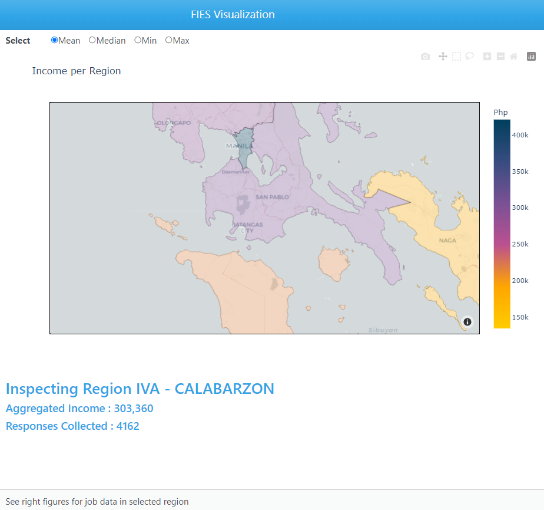
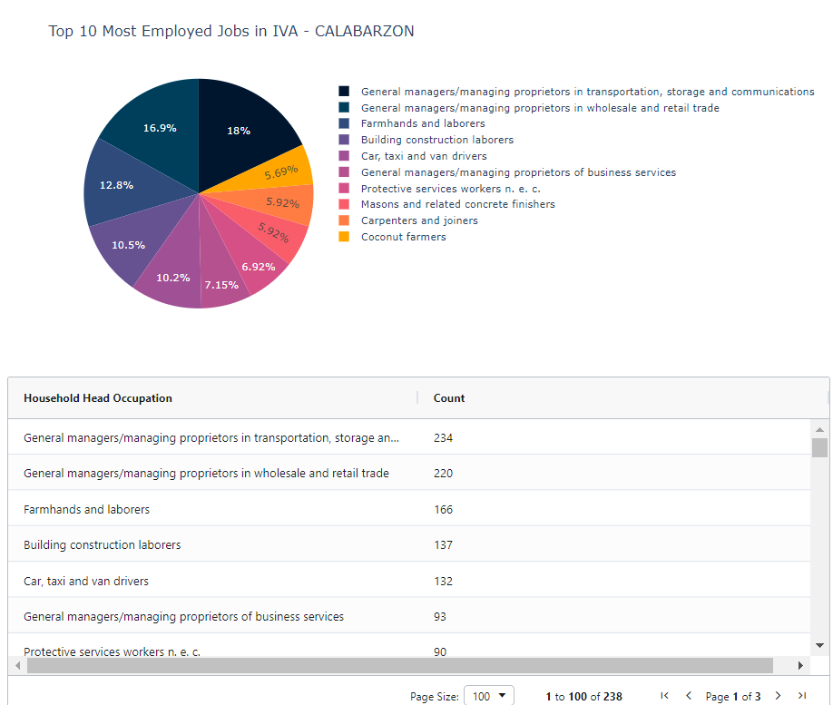

# Family Income Expenditure Survey WebApp
DATA101 Data Visualization Machine Project. 

## Product
<table width="100%">
    <tr>
        <td width="50%" align="center"></td>
        <td width="50%" align="center"></td>
    </tr>
    <tr>
        <td align = "center"><b>Briefer</b></td>
        <td align = "center"><b>Chloropeth of Regional Income</b></td>
    </tr>
    <tr>
        <td width="50%" align="center"></td>
        <td width="50%" align="center"></td>
    </tr>
    <tr>
        <td align = "center"><b>Profession Distribution</b></td>
        <td align = "center"><b>Nutrition by Family</b></td>
    </tr>
</table>


<p align="center"><b>Nutrition by Age</b></p>

## Description
This is a interactive web dashboard application built using `Dash`, `Plotly`, and `Geojson`.

Utilizing data from the **PSA Family Income and Expenditure Survey**, graphs were generated to help convey information and produce reports for stakeholders. 

The created visualization application offers valuable benefits to Policymakers and Government Officials, NGOs, and Economists in Private Sectors. It benefits the target audience, empowering them with data-driven insights, facilitating informed decision-making, and supporting their objectives in economic planning, research, social welfare, and market analysis. Ultimately, the interactive visualization application empowers policymakers to make evidence-based decisions, enhance transparency in governance, and drive meaningful progress toward reducing poverty and promoting inclusive economic growth in the Philippines.

### Learnings
1. Visualization Tools
    1. Plotly graphs (Bar, Pie, etc.)
    2. Chloropeth maps - Geojson to interpret JSON map data.
2. App Building
    1. Dash components (Navbar, Radio, etc.)
    2. App interactions by linking the Inputs, Callback functions, and Output. 


### Datasets
* FIES Dataset - https://www.kaggle.com/datasets/grosvenpaul/family-income-and-expenditure
* GeoJson Philippines : https://raw.githubusercontent.com/faeldon/philippines-json-maps/master/2023/geojson/country/lowres/country.0.001.json

## Project Team
- Bautista, Alicia Isis
- Celestino, Elizabeth
- Ong, Charles Matthew
- Suaybaguio, Kean Ivan

## Setup Instructions
Install the following libraries: 
```
    pip install plotly 
    pip install plotly_express
    pip install dash
    pip install dash_bootstrap_components
    pip install dash_daq
    pip install dash_ag_grid
    pip install ipynb
```

To run the application via **JupyterLab**:  
1. Navigate to `/DATA101-FIES/Dev/WebDev.ipynb`  
2. Run the file  
3. Go to `http://127.0.0.1:8053/` on your browser  


To run the application via **Command Line**:
1. Open command prompt or terminal
2. Navigate to the directory containing the `WebDev.py`
3. Enter `python WebDev.py`
4. Go to `http://127.0.0.1:8053/` on your browser  
